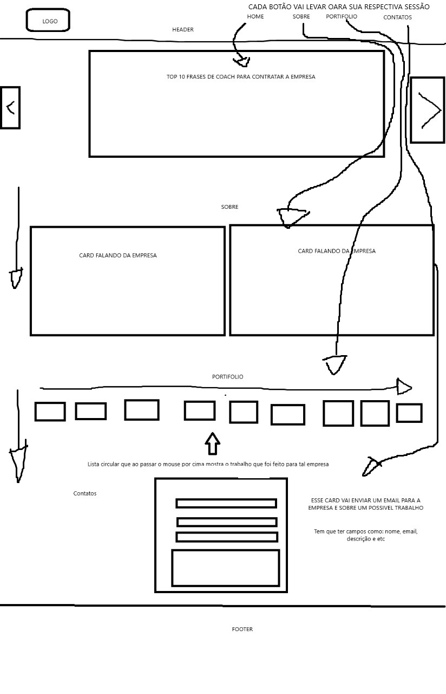

# Apresentação da proposta
**Empresa**: R Camelo topografia
\
**Ideia**: Criar um site para dar mais visibilidade para a empresa e que seja possível falar diretamente com ela.

## Requisitos levantados pela empresa
**Apresentação**: É necessário que o site informe um pouco sobre a empresa e quais são os serviços oferecidos, exemplo: apresentação de portifólio, histórico da empresa e etc.
\
**Aba de contatos**: É necessário algum espaço para que o usuário que está acessando o site possa enviar mensagem para a empresa.
\
**Suavidade**: O site tem que ser algo suave, sem translocações bruscas.

## Protótipo inicial
